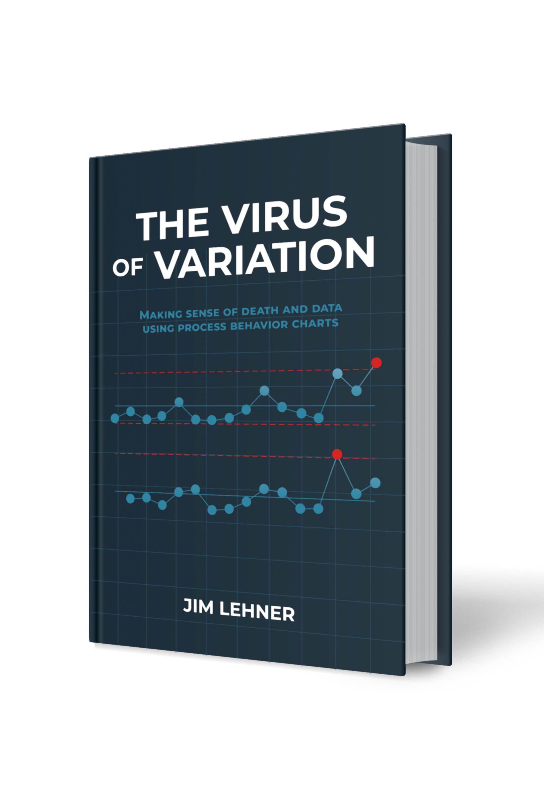

# The Virus of Variation: Making Sense of Death and Data using Process Behavior Charts
Welcome to the official GitHub repository for **The Virus of Variation: Making Sense of Death and Data using Process Behavior Charts**. 

Making sense of data, understanding variation, and improving processes is not a spectator sport. It is a method and technique that is best learned by doing. It is for this reason that the Python code, Excel files, and datasets used to generate the figures in the book are provided here.



The Python code and Excel files are organized by chapter title with the naming convetion for the files reflecting the naming convetion in the book.

The datasets used in the book are listed in the [Datasets](#datasets) section of this document. Under each dataset is a bulleted list of the chapters where the respective dataset is used. For instance, the `causes-of-death-in-1864-dublin.csv` dataset is used in Chapter 4 and Appendix B. As a result, the bulleted list that follows shows Chapter 4 and Appendix B.

Visit [BrokenQuality.com](https://www.BrokenQuality.com/bookshelf) for additional resources and details regarding the application and use of `process behavior charts`. 

If you have questions or would like to collaborate, send us an email at **James.Lehner@gmail.com** or **QualityIsBroken@gmail.com**. 

## Table of Contents
- [Python Code](#python-code)
- [Excel Files](#excel-files) 
- [Data](#data)
- [Process Improvement Library](#process-improvement-library)
- [Contributing](#contributing) 
- [Contact](#contact) 
- [License](#license)
- [Additional Information](#additional-information)

## Python Code
Python code is organized by chapter title. Specific figures in the code are labeled in accordance with the numbering scheme in **The Virus of Variation**. In instances where a chapter does not contain figures or calculations using Python, an 'NA' is shown in the list below. The files can be found [here](https://github.com/jimlehner/the-virus-of-variation/tree/main/python).

1. CHP_01_the_case_of_ignaz_semmelweis.ipynb
2. CHP_02_the_impact_of_handwashing_at_vienna_general.ipynb
3. CHP_03_measures_of_location.ipynb
4. CHP_04_measures_of_dispersion.ipynb
5. CHP_05_visual_syntax.ipynb
6. CHP_06_the_basics_of_bar_charts.ipynb
7. CHP_07_how_to_build_a_helpful_histogram.ipynb
8. CHP_08_trustworthy_times_series.ipynb
9. CHP_NA (09_the_virus_of_variation)
10. CHP_10_variation_and_the_process_principle.ipynb
11. CHP_11_the_landscape.ipynb
12. CHP_12_how_to_build_an_xmr_chart.ipynb
13. CHP_13_characterization
14. CHP_14_revisiting_vienna
15. CHP_15_other_types_of_signals.ipynb
16. CHP_16_are_shewharts_limits_different.ipynb
17. CHP_17_the_magic_of_written_reports.ipynb
18. CHP_18_a_framework_for_comparison.ipynb
19. CHP_19_improvement_and_its_principles.ipynb
20. CHP_20_insights_into_actions.ipynb
21. NA (appendix A)
22. NA (appendix B)
23. APP_C1_shewharts_initial_resistance_measurement_calculations.ipynb
24. APP_C2_shewharts_additional_resistance_measurement_calculations.ipynb
25. APP_C3_calculations_for_rational_subgroups.ipynb
26. APP_D1_before_handwashing_policy_at_vienna_general.ipynb
27. APP_D2_after_handwashing_policy_at_vienna_general.ipynb
28. APP_E1_before_pathological_anatomy_at_vienna_general.ipynb
29. APP_E2_after_pathological_anatomy_at_vienna_general.ipynb
30. APP_F1_dublin_temporal_comparison_calculations_1784_to_1793.ipynb
31. APP_F2_dublin_temporal_comparison_calculations_1831_to_1840.ipynb
32. APP_F3_vienna_temporal_comparison_calculations_1784_to_1793.ipynb
33. APP_F4_vienna_temporal_comparison_calculations_1831_to_1840.ipynb
34. APP_G1_dublin_hospital_physical_comparison_calculations.ipynb
35. APP_G2_vienna_hospital_physical_comparison_calculations.ipynb
36. APP_H1_vienna_general_baseline_calculations.ipynb
37. APP_H2_first_clinic_calculations.ipynb
38. APP_H3_second_clinic_calculations.ipynb
39. APP_I_why_standard_deviation_doesnt_work.ipynb
40. APP_J_tables_for_bias_correction_factors_and_scaling_factors.ipynb

## Excel Files
Excel files are organized by chapter title using the same structure as the Python code.  Within each Excel files, is an overview tab, a data tab, and a tab for each of the tables or figures using the naming convention from **The Virus of Variation**. In instances where a chapter does not have an Excel file, 'NA' is shown in the list below. File files can be found [here](https://github.com/jimlehner/the-virus-of-variation/tree/main/excel_files).

1. CHP_01_the_case_of_ignaz_semmelweis.xlsx
2. CHP_02_the_impact_of_handwashing_at_vienna_general.xlsx
3. CHP_03_measures_of_location.xlsx
4. CHP_04_measures_of_dispersion.xlsx
5. CHP_05_visual_syntax.xlsx
6. CHP_06_the_basics_of_bar_charts.xlsx
7. CHP_07_how_to_build_a_helpful_histogram.xlsx
8. CHP_08_trustworthy_times_series.xlsx
9. NA (09_the_virus_of_variation)
10. CHP_10_variation_and_the_process_principle.xlsx
11. CHP_11_the_landscape.xlsx
12. CHP_12_how_to_build_an_xmr_chart.xlsx
13. CHP_13_characterization.xlsx
14. CHP_14_revisiting_vienna.xlsx
15. CHP_15_other_types_of_signals.xlsx
16. CHP_16_are_shewharts_limits_different.xlsx
17. CHP_17_the_magic_of_written_reports.xlsx
18. CHP_18_a_framework_for_comparison.xlsx
19. CHP_19_improvement_and_its_principles.xlsx
20. CHP_20_insights_into_actions.xlsx
21. NA (appendix A)
22. APP_B_calculating_the_pareto_chart_cumulative_percentage_curve.xlsx
23. APP_C_shewharts_resistance_measurements.xlsx
24. APP_D_the_impact_of_handwashing_at_vienna_general.xlsx
25. APP_E_the_impact_of_pathological_anatomy_at_vienna_general.xlsx
26. APP_F_temporal_comparison.xlsx
27. APP_G_physical_comparison.xlsx
28. APP_H_improvement_at_vienna_general.xlsx
29. NA (appendix I)
30. APP_J_tables_for_bias_correction_factors_and_scaling_factors.xlsx

## Data
18 unique datasets are used in [The Virus of Variation](https://www.brokenquality.com/book). The datasets can be found [here](https://github.com/jimlehner/the-virus-of-variation/tree/main/data). The following list shows the dataset followed by the chapter(s) in the book that use it to create tables and figures and perfrom calculations.

1. average-range-chart-scaling-factors-using-average-range.csv
	- Appendix J
2. average-range-chart-scaling-factors-using-median-range.csv
	- Appendix J
3. bias-correction-factor-table.csv
	- Appendix J
4. causes-of-death-in-1864-dublin.csv
	- Chapter 04, *Measures of Location*
	- Appendix B
5. death-to-birth-rates-by-hospital-1784-to-1849.csv
	- Chapter 08, *The Basics of Bar Charts*
	- Chapter 10, *How to Build a Helpful Histogram*
	- Chapter 11, *Trustworthy Time Series*
6. home-runs-by-season.csv
	- Chapter 15, *Other Types of Signals*
7. impact-of-handwashing-death-to-birth-rates.csv
	- Chapter 12, *How to Build an XmR Chart*
	- Chapter 14, *Revisiting Vienna*
	- Chapter 15, *Other Types of Signals*
	- Appendix D
8. improvement-death-to-birth-rates.csv
	- Chapter 19, *Improvement and Its Principles*
	- Appendix H
9. obstetrics-annual-salaries-1845.csv
	- Chapter 03, *Measures of Location*
10. pathological-anatomy-death-to-birth-rates.csv
	- Chapter 17, *The Magic of Written Reports*
	- Appendix E
11. physical-comparison-death-to-birth-rates.csv
	- Chapter 18, *A Framework for Comparison*
	- Appendix G
12. sales-by-regions.csv
	- Chapter 13, *Characterization*
	- Chapter 16, *Are Shewhart's Limits Different?*
	- Appendix I
13. shewharts-resistance-measurements-rational-subgroups.csv
	- Appendix C
14. shewharts-resistance-measurements.csv
	- Chapter 10, *Variation and the Process Principle*
	- Chapter 11, *The Landscape*
	- Chapter 19, *Improvement and Its Principles*
	- Appendix C
15. software-verification-death-to-birth-rates.csv
	- Chapter 20, *Insights into Actions*
16. temporal-comparison-death-to-birth-rates.csv
	- Chapter 18, *A Framework for Comparison*
	- Appendix F
17. vienna-general-death-to-birth-rates.csv
	- Chapter 01, *The Case of Ignaz Semmelweis*
	- Chapter 02, *The Impact of Handwashing*
	- Chapter 03, *Measures of Locaiton*
	- Chapter 04, *Measures of Dispersion*
	- Chapter 05, *Visual Syntax*
	- Chapter 15, *Other Types of Signals*
18. wafer-placement-x-position.csv
	- Chapter 19, *Improvement and Its Principles*

## Process Improvement Library
The `process_improvement.py` library simplifies the task of building process behavior charts using Python. The library is available on PyPi.org and can be installed with pip using the following command:

```pip install process_improvement```

Alternatively, `process_improvement.py` can be installed from GitHub by entering the following command using the `command prompt`:

```pip install git+https://github.com/jimlehner/process_improvement```

For additional details regarding the `process_improvement.py` library [click here](https://github.com/jimlehner/process_improvement).

## Contributing
To contribute to the Python code base, follow these steps:
1. Fork the repository.
2. Clone your fork locally:
```
git clone https://github.com/<your-username>/thevirusofvariation.git
cd thevirusofvariation/pythoncode
```
3. Create a branch: ```git checkout -b <branch_name>```. 
4. Make your changes and commit them:  ```git commit -m '<describe your changes>'```
5. Push to the original branch: ```git push origin <branch_name>/<location>```.
6. Open a pull request to the main repository.

Alternatively see the GitHub documentation on [creating a pull request](https://docs.github.com/en/pull-requests/collaborating-with-pull-requests/proposing-changes-to-your-work-with-pull-requests/creating-a-pull-request).

## Contact
If you want to contact me you can reach me at [James.Lehner@gmail.com](James.Lehner@gmail.com) or [qualityisbroken@gmail.com](QualityIsBroken@gmail.com).

## License
**The Virus of Variation: Making Sense of Death and Data Using Process Behavior Charts* was published by Broken Quality Press, LLC.

## Additional Information
- **Parts of a Process Behavior Chart**: Invented by Dr. Walter Shewhart in the mid-1920s at Bell Laboratories, PBCs are composed of two charts: the `X-chart` and the `mR-chart`. Where the `X-chart` bounds the variation associated with individual values the `mR-chart` bounds the value-to-value variation. This is made possible through the calculation of a trio of limits known as process limits. The `upper process limit (UPL)` and `lower process limit (LPL)` are used on the `X-chart`. The `upper range limit (URL)` is used on the `mR-chart`. 
- **Two types of variation**: Inherent in the characterizations of `predictable` and `unpredictable` is the tyoe of variation action a process. A predictable process is influenced by only `routine` causes of variation. An `unpredictable` process is influenced by both `routine causes of variation` and `assignable` causes of variation.  
- **Improvement**: 
	- **Predictable**: To improve a predictable process `routine` causes of variation must be `identified`, `understood`, and `mitigated`.  This requires fundamental changes to the process must be made. These include, but are not limited to, changes to raw materials, adjustment to system settings, redesign of stations, redesign of software, calibration of measurement systems. 
	- **Unpredictable**: To improve an unpredictable process  `assignable` causes of variation must be `identifed`, `understood`, and `eliminated`. To begin this process, an investigation into values that fall outside the process limits on the `PBC` must be performed. 
- If you are unfamiliar with process behavior charts (control charts) and want to learn more, visit  [BrokenQuality.com](https://www.brokenquality.com/).